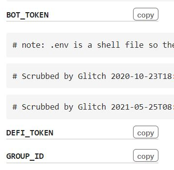
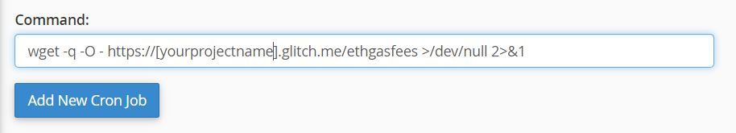
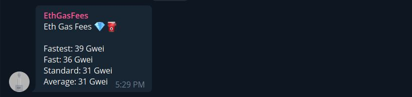

# EthGasFeesBot
[EthGasFeesBot] is a telegram cryptocurrency Bot created by @icyurei or @ikmxleo. You can check the current gas price of Ethereum in Gigawei (Gwei) every 3 hours or any time that you want. Can only be run with Cron Jobs and using Glitch.me. A little bit different with previous Bot.

donate me some ETH

0xa01A95878447dfbCdb47d85ed6898C1d241Af5d6⠀

How to run

1) Create Glitch accout at "https://glitch.com/"
2) Copy the content of package.json to the glitch package.json
3) Copy the content of ethgasfeesbot.js to the glitch server.js
4) Go to .env tabs and edit the BOT_TOKEN, DEFI_TOKEN, GROUP_ID with your particular API Key like below

5) To execute you can use below command on cron jobs at Cpanel
  
//Without email
wget -q -O - https://[yourprojectname].glitch.me/ethgasfees >/dev/null 2>&1 
  
//With email
wget -q -O - https://[yourprojectname].glitch.me/ethgasfees 
  

6) Remove the brackets [] and insert your project name there
7) Stan B.I Illa Illa

Some snapshot inside Telegram

//Output in Telegram Bot

